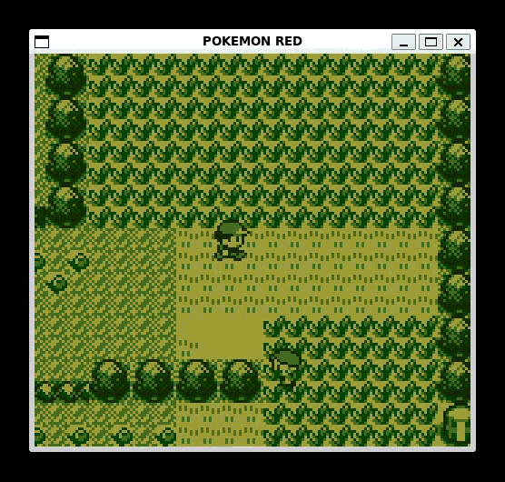
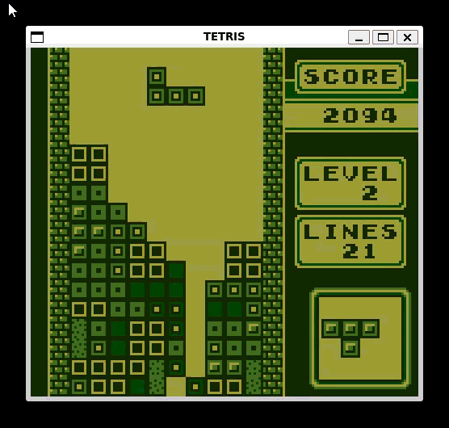
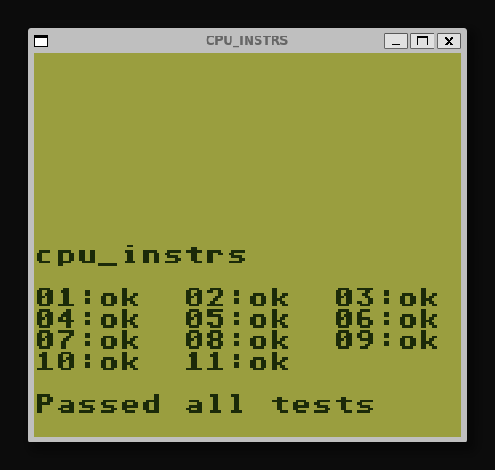
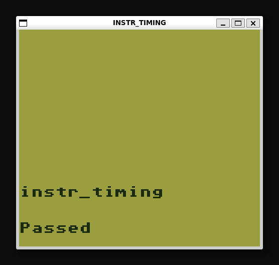
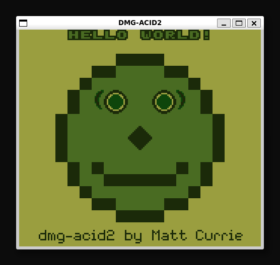
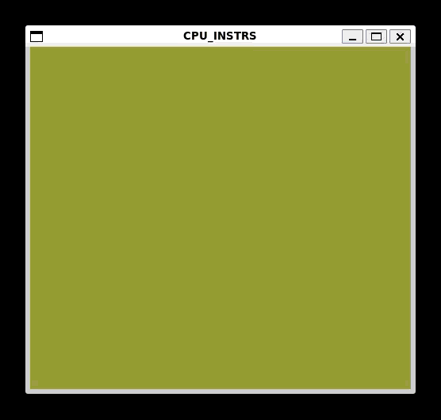

# Gameboy Emulator

A cycle-accurate emulator for the [Nintendo Gameboy](https://en.wikipedia.org/wiki/Game_Boy) that can play most commercial games (such as Pokemon and Tetris).

The emulator core is written in C and Rust, with tests written in Python.

# Demos

Pokemon Red:

Tetris:

View more demos in the [assets](assets/) folder.

# Building

Requirements:
* C compiler (like `gcc`)
* Rust toolchain (see [rustup](https://rustup.rs/))
* [cbindgen](https://github.com/mozilla/cbindgen?tab=readme-ov-file#quick-start)
* Make
* [SDL3](https://github.com/libsdl-org/SDL/blob/main/INSTALL.md)
* pkg-config (make sure it can detect SDL3 by running `pkg-config --libs sdl3`)
* (optional) python3 for testing
* (optional) clang-format to format code

After setting up all dependencies, run `make all` to build the project. After building, the executable should be in `build/gbemu[.exe]`. To pass a ROM file, use the command line option `[-r/--rom rom file]`. Run the executable with no command line options to see usage.

If you installed python3, run `make test` to run the pytest tests. If you installed `clang-format` then run `make format` to format the project.

The emulator should now run correctly. If you have any issues, [open an issue](https://github.com/nishantc1527/gameboy/issues/new) on Github.

# Motivation

This emulator is intended to be 100% accurate compared to the original Gameboy. To achieve this, I want it to pass every popular test ROM suite as well as custom made test ROMs that test obscure behavior and weird edge cases.

Accurate emulators are a major component of [game preservation](https://en.wikipedia.org/wiki/Video_game_preservation) by ensuring that every game made for original hardware is digitally archived on the internet with zero changes.

# Features

## Mappers

Supports the following mappers:

* [No mapper](https://gbhwdb.gekkio.fi/cartridges/no-mapper.html)
* [MBC1](https://gbhwdb.gekkio.fi/cartridges/mbc1.html)
* [MBC3](https://gbhwdb.gekkio.fi/cartridges/mbc3.html)

## CPU & Interrupts

Passes all of [Blargg's test ROMs](https://github.com/retrio/gb-test-roms) (excluding CGB and sound tests). This means that all CPU instructions are implemented and functional with cycle-accurate timing, and interrupts all work as intended.

[CPU Instr](https://github.com/retrio/gb-test-roms/tree/master/cpu_instrs):

[Instr Timing](https://github.com/retrio/gb-test-roms/tree/master/instr_timing):

## Display

Passes [DMG Acid 2](https://github.com/mattcurrie/dmg-acid2), which tests the display. This means that the PPU is working correctly and is fully functional.

[DMG Acid 2](https://github.com/mattcurrie/dmg-acid2):

## Boot ROM

Supports boot ROM functionality, meaning whenever the emulator is turned on it loads the boot ROM at memory location 0x0000 and starts from there.

## Automated Testing

This emulator supports a headless mode to not spawn a window (`-h or --headless`). It also includes an option to tell it that it's running a specific kind of test ROM (eg. `-t or --test blargg`). It will then watch the test and output the result when finished (pass or fail).

Using this interface, there are several python testing scripts in the [tests](tests/) directory that batch run test ROM suites using the headless mode and verifies the output using [pytest](https://docs.pytest.org/en/stable/). These tests have been integrated into the repository's continuous integration workflow to catch breaking changes.

## Pokemon Save File Patching (Gen I)

Whenever Pokemon Red or Blue is booted up, it runs a checksum verification to ensure the save file hasn't been messed with. This emulator automatically sets the correct checksum so that you can edit the save file without worrying about corrupting the game. This feature is automatically turned on if Pokemon Red or Blue is detected.

If you want to learn more about the save file structure, [here](https://bulbapedia.bulbagarden.net/wiki/Save_data_structure_(Generation_I)) is a good reference file.

## Customization

Customization is done through the config files in the [config](config/) directory.

For colors, use the macros called `HEX_WHT` through `HEX_BLK` in the [colors.h](config/colors.h) file. You can change the hex code of each tone (white, light grey, dark grey, and black).

For screen size, you can change the variables `SCALE_X` and `SCALE_Y` in the [display.h](config/display.h) file, which scale the X and Y axes. 

For controls, use the macros KEY_[button name] in the [controls.h](config/controls.h). For example, to set a custom key to press the A button, the variable is called KEY_A. You can use [this file](https://wiki.libsdl.org/SDL3/SDL_Keycode) to find the corresponding keycode for each key on your keyboard.

## Roadmap

These features are planned or in active development.

* Audio
* Basic UI
* More memory bank controllers

# References

All the technical research for this project was done from [this site](https://gbdev.io/pandocs/About.html). For implementing a cycle accurate CPU, I used [this](https://meganesu.github.io/generate-gb-opcodes/) opcode table. If you plan to make your own emulator, these are the primary resources used for development.

