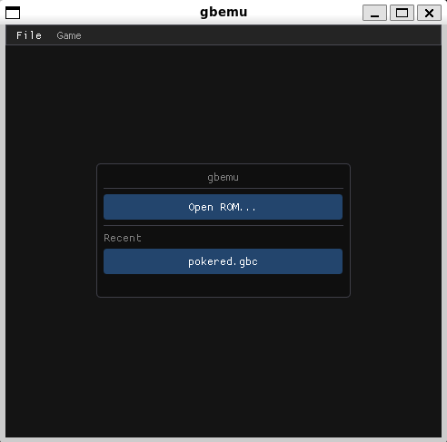
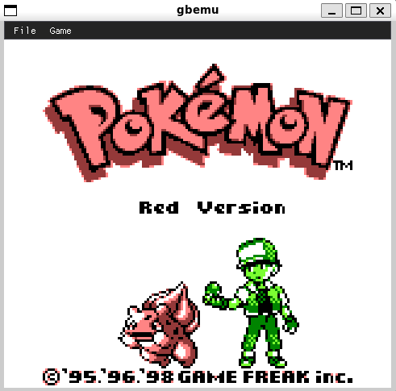
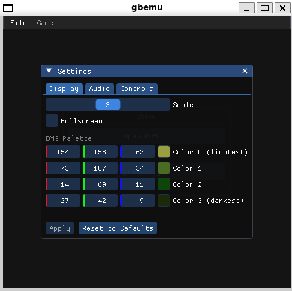
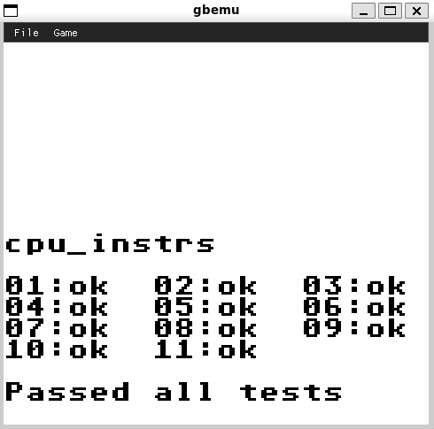

# Game Boy Emulator

A Game Boy (DMG) and Game Boy Color (CGB) emulator. Core written in C2x, cartridge/MMU layer written in Rust, SDL3 + Dear ImGui frontend.



## Cartridges

Supported MBCs:

| Code             | Mapper | Notes                                          |
|------------------|--------|------------------------------------------------|
| `0x00`           | No MBC | Plain 32 KiB ROM                               |
| `0x01`–`0x03`    | MBC1   | Includes multicart detection, 1 MiB mode       |
| `0x05`–`0x06`    | MBC2   | Built-in 512×4-bit RAM                         |
| `0x0F`–`0x13`    | MBC3   | RTC (S/M/H/DL/DH) with latch and halt          |
| `0x19`–`0x1E`    | MBC5   | Up to 8 MiB ROM, 128 KiB RAM                   |

Save RAM is written to disk on exit and reloaded on startup. The MBC3 RTC ticks with CPU cycles, not wall-clock time, so pausing the emulator pauses the clock.



## Frontend

- Open ROM dialog and a recent-ROM list (up to 10).
- Reset, pause, fast-forward, screenshot, fullscreen toggle.
- Settings window, persisted to TOML between runs:
  - Integer window scale.
  - DMG palette: the four colors used for DMG output.
  - Volume + mute, applied live.
  - Full keybinding for A, B, Start, Select, D-pad, Pause, Screenshot.
- Screenshots saved as PNG.



## Boot ROMs

The DMG and CGB boot ROMs (from the `gb-bootroms` submodule) are built with `rgbds` and embedded into the binary at compile time.

## Build

Dependencies: `gcc`, `g++`, Rust toolchain (`cargo`), `cbindgen`, Python 3.10+, SDL3 (via `pkg-config`), `rgbasm`/`rgbfix`/`rgbgfx`/`rgblink` for building the boot ROMs and the pokered submodule. The `Dockerfile` reproduces a working environment on Ubuntu 24.04.

```
make            # builds build/gbemu and build/gbemu_headless
make gbemu      # builds SDL frontend only
make gbemu_headless
make test       # builds venv, runs pytest against the headless binary
make verify     # format check + clippy + tests (CI entry point)
make format     # clang-format + cargo fmt
make lsp        # generate compile_commands.json via bear
make clean
```

## Headless runner

`build/gbemu_headless` is a separate, GUI-less binary. It runs a ROM to a stopping condition and optionally writes a screenshot of the final frame:

```
gbemu_headless -r <rom.gb> [-t <category>] [-s <out.png>] [-f <stop_frame>]
               [-d] [-w <hex_addr>]... [--version]
```

- `-r, --rom <file>` ROM file to run.
- `-t, --test <category>` Test category to drive (see below).
- `-s, --screenshot <file>` Write the final frame to a PNG.
- `-f, --stop-frame <N>` Stop after N total frames.
- `-d, --disassembly` Print per-instruction disassembly to stdout.
- `-w, --watch <hex>` Watch a memory address (up to 8).

The test harness drives this binary. Recognized categories: `blargg_cpu`, `blargg_cpu_time`, `blargg_mem_time`, `blargg_mem_time2`, `blargg_halt_bug`, `blargg_interrupt_time`, `blargg_audio`, `blargg_oam_bug`, `blargg_cgb_sound`, `acid2`, `mealybug`, `mooneye`, `age`, `same`, `mbc3`, `rtc3_basic`, `rtc3_range`, `rtc3_sub`, `gambatte`, `micro`, `little`, `bully`, `scribble`, `strike`, `turtle`. Detection method depends on the suite: serial output, register fingerprint, magic memory locations, or a reference screenshot.

## Test suites (under `test_roms/`)

All are git submodules of upstream test repositories:

- Blargg: `cpu_instrs`, `instr_timing`, `mem_timing`, `mem_timing-2`, `dmg_sound`, `cgb_sound`, `halt_bug`, `interrupt_time`, `oam_bug`
- Mooneye Test Suite + the Wilbert Pol fork
- AGE test ROMs
- SameSuite
- dmg-acid2, cgb-acid2, cgb-acid-hell
- Mealybug Tearoom Tests
- Gambatte (screenshot-compare regression suite)
- gbmicrotest
- mbc3-tester, rtc3test
- scribbltests, strikethrough, turtle-tests, little-things-gb, bully

The pytest harness (`tests/`) parameterizes over each ROM file and either:

1. drives the ROM under the appropriate `-t` category and asserts pass/fail from stdout, or
2. runs to a fixed frame count and pixel-compares the screenshot against a checked-in reference.

`tests/check_coverage.py` walks `test_roms/` and asserts that every applicable ROM is actually referenced by a test, with explicit allowlists for ROMs that are intentionally skipped (combined runners, demos, missing references).



## Scripts

- `scripts/disassembler.py`: standalone Python disassembler for a ROM.
- `scripts/trace.py`: drives `gbemu_headless -d` and post-filters the trace (grep, last-N, context around addresses, watch points).
- `scripts/bank_dump.py`: dumps a specific ROM bank to text.
- `scripts/rom_info.py`: prints the cartridge header.
- `scripts/gen_boot_roms.py`: embeds built boot ROMs into the build.
- `scripts/gen_boot_refs.py`: regenerates reference outputs against the pokered ROM.

## Pokémon Red helper

An optional layer, gated on the Pokémon Red cartridge title, that handles the Generation-I save layout: recomputing the save checksum and decoding the player name from the in-cart RAM character encoding.

## What is not implemented

- SGB borders/commands.
- Link cable; the serial peripheral only captures `SB` writes.
- These test suites are skipped in the harness: `blargg_audio`, `blargg_oam_bug`, `blargg_mem_time2`, `blargg_interrupt_time`, `blargg_cgb_sound`.
